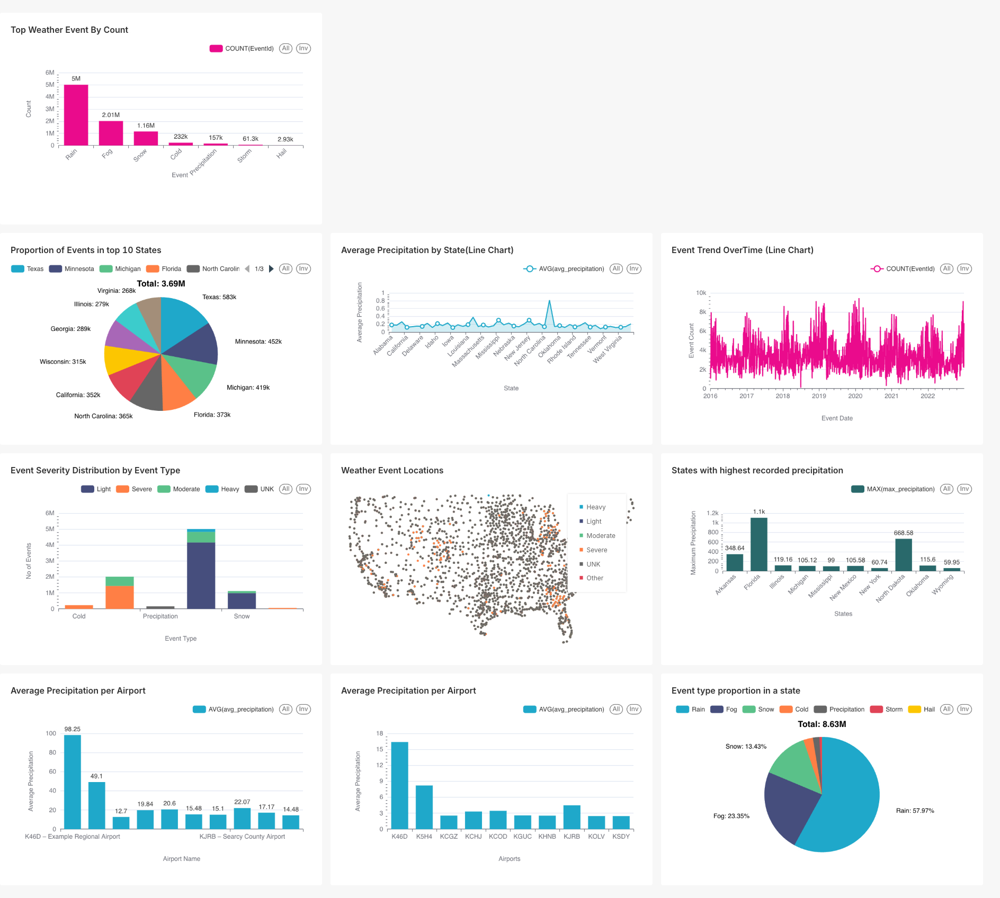

WeatherData ETL Project

This project is an ETL pipeline for US Weather Data (2016–2022) using Python, PySpark, and PostgreSQL, with visualizations in Superset.
It extracts raw CSV and JSON data, transforms it into clean and aggregated datasets, and loads it into PostgreSQL.

2. Requirements 
Python 3.12

JDK 11

PySpark (installed via script pyspark-installation.sh)

PostgreSQL (for storing transformed data)

Superset (for dashboard visualization)

Step 1: Clone the repository
git clone https://github.com/prabingupta/WeatherData.git
cd WeatherData/ETL

Step 2: Set up a virtual environment
python3 -m venv venv
source venv/bin/activate 

Step 3: Install dependencies

Run the PySpark installation script:
chmod +x ../pyspark-installation.sh
../pyspark-installation.sh

Step 4: Extract Stage
Place all your zip files (CSV & JSON) in the Downloads folder (or update path in extract.py).

Run the extract script:
python extract/extract.py <extract_output_dir>

This will unzip all files and fix JSON dictinaries.
Logs will be generated in extract_csv.log.

Step 5: Transform Stage
python transform/transform.py <extract_output_dir> <transform_output_dir>

Stage 1: Cleaned data is saved as Parquet.

Stage 2: Master table and Stage 3: Query-optimized tables are saved.

Logs will be saved in weather_transform.log.

Step 6: Load Stage
Make sure PostgreSQL is running and credentials are updated in load/load.py.

Run the load script:

python load/load.py <transform_output_dir>
Stage 1: Cleaned weather data → weather_raw table

Stage 2: Aggregated data → weather_aggregates table

Logs will be saved in weather_load.log.

Step 7: Superset Dashboard
1. Install and start Superset:
superset db upgrade
superset init
superset run -p 8088 --with-threads --reload --debugger

2. Open your browser and go to:
http://localhost:8088

Connect Superset to your PostgreSQL database and create dashboards using the tables:

weather_raw

weather_aggregates
You can create charts like bar charts, pie charts, and line charts for visualization.

## Visualization of US Weather Event Dataset

